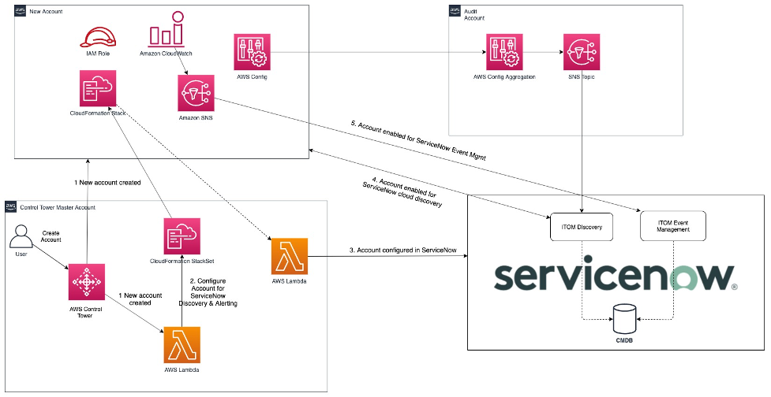

# Automate provisioning of AWS Account for ServiceNow Cloud Discovery and IT Operations management with Control Tower lifecycle events

This solution provides an automated approach with integration to [AWS Control Tower](https://aws.amazon.com/controltower/) to automatically configure new AWS accounts created through Control Tower in ServiceNow for [Cloud Discovery](https://www.servicenow.com/products/cloud-management.html) and [Cloud Management](https://www.servicenow.com/products/cloud-management.html).

**Contents:**
* [Solution Overview](#solution-overview)
* [Pre-requisites](#pre-requisites)
* [Solution Deployment](#solution-deployment)
* [Seeing It In Action](#seeing-it-in-action)
* [Cleaning Up](#cleaning-up)

## Solution Overview

ServiceNow&#39;s [Cloud Discovery](https://www.servicenow.com/products/cloud-management.html) is a core component of the ServiceNow&#39;s [IT Operations management](https://www.servicenow.com/products/it-operations-management.html). The discovery process can automatically find resources and applications running in customer&#39;s AWS environment and update those in ServiceNow&#39;s [Configuration management database (CMDB)](https://www.servicenow.com/content/dam/servicenow-assets/public/en-us/doc-type/resource-center/data-sheet/ds-configuration-management.pdf).

Setting up ServiceNow Cloud discovery and/or Cloud Management for an AWS account requires the following configuration in ServiceNow

1. Credentials for AWS account configured as cloud credentials in ServiceNow
2. AWS Account information added to Service account table
3. Configure ServiceNow to discover data centers for the AWS account
4. Configure ServiceNow&#39;s Cloud Discovery process for the desired data AWS regions
5. Configuring AWS Config to send configuration change events to ServiceNow to update the CMDB in real time

Once the ServiceNow Cloud Discovery process is enabled for an AWS account, the discovery process starts collecting AWS resource information in the CMDB. This information in CMDB can then be leveraged by ServiceNow&#39;s Operations management modules such as Change management, Event and Incident management to provide those capabilities for AWS environment.

This solution fully automates the provisioning of AWS account in ServiceNow to enable ServiceNow Cloud discovery and cloud management. The solution leverages [AWS Control Tower](https://aws.amazon.com/controltower/) lifecycle events to trigger an [AWS Lambda](https://aws.amazon.com/lambda/) function that provisions the account in ServiceNow. A high-level architecture of the solution is mapped in the following diagram

Here is an overview of how the solution works:

- The solutions main template performs the initial setup in ServiceNow and creates ServiceNowConfig [CloudFormation StackSet](https://docs.aws.amazon.com/AWSCloudFormation/latest/UserGuide/what-is-cfnstacksets.html) to enable ServiceNow provisioning for member accounts in the AWS Control Tower environment
- When a new AWS account is created through the Control Tower Account Factory, the Control Tower lifecycle event triggers the ServiceNowStackSetHandler lambda to run
- The ServiceNowStackSetHandler lambda updates the ServiceNowConfig StackSet to start ServiceNow provisioning for the new account
- The ServiceNowConfig stack instance runs in the new account and triggers the ServiceNowConfigFunction lambda function to start provisioning of the AWS account in ServiceNow
- [AWS Config](https://aws.amazon.com/config/) events for new account are aggregated in the Audit account and sent to ServiceNow. ServiceNow uses the event info to update the CMDB for resource configuration changes
- If [AWS CloudWatch](https://docs.aws.amazon.com/AmazonCloudWatch/latest/monitoring/WhatIsCloudWatch.html) integration is enabled, then the ServiceNowConfig stack creates an SNS topic with subscription to ServiceNow event management to enable sending CloudWatch alarms to ServiceNow for alert and incident management
- At a set schedule, ServiceNow performs discovery for AWS resources in the new account and populates its CMDB

## Pre-requisites

This solution assumes that you have access to the Control Tower master account. We deploy the solution to the Control Tower master account and leverage the AWSControlTowerExecution role from Control Tower. Additionally, this solution assumes that you have ServiceNow Discovery, Cloud Management and Event Management subscriptions and have those plugins enabled on your ServiceNow instance. If you do not have these subscriptions you can make use of the [AWS Service Management Connector](https://docs.aws.amazon.com/servicecatalog/latest/adminguide/integrations-servicenow.html) for ServiceNow to track AWS resources in the CMDB. The AWS Service Management Connector leverages AWS Config to populate AWS resources in CMDB.

Before deploying the solution, you must gather the following information:

- The endpoint URL for your ServiceNow cloud instance. If you do not have a ServiceNow instance, you can request a developer instance through the ServiceNow developer [page](https://developer.servicenow.com/dev.do). Please ensure you have the ServiceNow Discovery, CloudManagement and Event management plugins activated on the ServiceNow instance
- A ServiceNow MID Server to perform discovery in the AWS environment. You can use an existing MID server as long as it has network connectivity to AWS API endpoints \*.amazonaws.com. If you do not have a MID Server, you can set one up using the instruction [here](https://docs.servicenow.com/bundle/orlando-it-operations-management/page/product/cloud-management-v2-setup/task/aws-setup-mid-server-cloud-mgt.html)
- Credentials of a ServiceNow user that has permissions to make REST API calls to ServiceNow. This user needs to have permissions to access ServiceNow REST API, specifically the Table API, Discovery API and cloud management APIs as well as ServiceNow cloud event integration (if enabling CloudWatch Alert integration). If you don&#39;t have a user provisioned, you can create one by following the ServiceNow documentation [here](https://docs.servicenow.com/bundle/madrid-application-development/page/integrate/inbound-rest/concept/c_GettingStartedWithREST.html)
- An [Amazon S3](http://aws.amazon.com/s3) bucket to host the Lambda package and to upload the CloudFormation template for ServiceNow configuration in new accounts. Identify or [create a bucket](https://docs.aws.amazon.com/AmazonS3/latest/user-guide/create-bucket.html), and take note of that bucket&#39;s name. The Amazon S3 bucket must be in the same Region in which you plan launch AWS CloudFormation, and should be a [Region supported by Control Tower](https://aws.amazon.com/controltower/faqs/#Availability)
- Clone [this](https://github.com/aws-samples/aws-control-tower-servicenow-itom-integration) repo or download the zip file and unzip the contents on your local machine. This repo contains a CloudFormation template that creates all the necessary components for the solution

## Solution Deployment

### Solution CloudFormation templates
In this solution we provide three [AWS CloudFormation](https://aws.amazon.com/cloudformation/#:~:text=AWS%20Cloud%E2%80%8BFormation&amp;text=AWS%20CloudFormation%20allows%20you%20to,AWS%20and%20third%20party%20resources.) templates as below. These templates are located in the cloudformation/templates folder within the solution repo.

- **master-account-setup.yaml:** The master-account-setup.yaml CloudFormation template is the main CloudFormation template for this solution. This CloudFormation template deploys all of the solution components in the Control Tower master account
- **servicenow-setup.yaml:** The servicenow-setup.yaml CloudFormation template is to configure the necessary components for ServiceNow provisioning in accounts managed by Control Tower. This template is deployed to AWS Control Tower accounts using AWS CloudFormation StackSet created in the Control Tower master account.
- **aws-config-servicenow-integration.yaml** : This template is to configure streaming of AWS Config events to ServiceNow, so that ServiceNow can update CMDB with resource information in real time

### Packaging the Lambda code
In this solution, we provide you with sample code for Lambda function that configures AWS account in ServiceNow. You can also clone the GitHub repo to tailor the code to your needs and contribute. The Lambda function is written in Python, but is too large to be included in-line in the CloudFormation template. To deploy it, you must package it.

Download the code or clone this repo from GitHub. Decompress if you downloaded the ZIP version. Open a command prompt. Navigate to the folder into which you extracted the zip file or cloned the repo and run 'cd src' to change to the subfolder. There is a package script in the folder that creates a zipped package for the two Lambda functions provided as part of this solution. Depending on your operating system run the script as below.

Bash  
`./package.sh`

PowerShell  
`./package.ps1`

The package script creates zip for the two lambda functions used by the solution and copies them under lambda-zip folder. After running the above script verify that you see the zip files created under lambda-zip folder. Then follow the steps below to deploy the solution.

### Steps for deploying the solution

**Step 1)** If you haven&#39;t already, please collect the information described in the pre-requisite section

**Step 2)** If you haven&#39;t already, clone this repo or download the zip file and unzip to local folder.Package the lambda as per instructions in the previous step. Then upload the aws-control-tower-servicenow-itom-integration folder to the S3 bucket that you identified in the pre-requisite step

**Step 3)** Launch the AWS CloudFormation stack

In this step you will be creating an AWS CloudFormation stack using the solution&#39;s main CloudFormation template following the steps:

1. Go to **AWS CloudFormation** in the **AWS Management Console**
2. Confirm that your console session is in the same Region as the Amazon S3 bucket in which you stored the code
3. Choose Create Stack and select **With new resources (standard)**
4. On the Create Stack page, under Specify template, select the  **Upload a template file**
5. Select  **Choose file** and select the **master-account-setup.yaml** template file from the local folder where you downloaded solution content in Step 2. The **master-account-setup.yaml** is under cloudformation/templates folder
6. Choose  **Next**  to continue
7. On the Specify Stack Details page, give your stack a name such as &quot;ServiceNowSetupMainStack&quot;. Under Parameters, review the default parameters and enter the values for parameters (pServiceNowUrl, pServiceNowAPIUserName, pServiceNowAPIUserPassword, pSolutionS3Bucket, pOrganizationUnitsToConfigure) based on information gathered in the pre-requisites steps
8. On the Configure stack options page you can choose to add tags, choose additional options, or just choose Next
9. On the Review page, validate your parameters and acknowledge that IAM resources will be created. Finally, select Create stack

**Step 4)** Launch the AWS CloudFormation stack for integrating AWS Config data with ServiceNow:

AWS Config captures configuration changes to resources in your AWS environment. This data can be sent to ServiceNow to have ServiceNow update the CMDB in real time. In this step we will be deploying a CloudFormation Stack that enables AWS Config events to be sent to ServiceNow. Since AWS Control Tower aggregates AWS Config data in the Audit account we will need to deploy this CloudFormation stack in the Audit account.

1. Sign into Audit Account and navigate to AWS CloudFromation in the **AWS Management Console**
2. Confirm that your console session is in the same Region as the Amazon S3 bucket in which you stored the code
3. Choose Create Stack and select **With new resources (standard)**
4. On the Create Stack page, under  **Specify template** , select the  **Upload a template**
5. Select  **Choose file** and select aws-config-servicenow-integration.yaml
6. Choose  **Next**  to continue
7. On the Specify Stack Details page, give your stack a name such as &quot;AWSConfigServiceNowIntegration&quot;. Under Parameters, review the default parameters and enter the values for parameters (pServiceNowEndpoint, pServiceNowUserName, pServiceNowUserPassword) based on information gathered in the pre-requisites steps
8. On the Configure stack options page you can choose to add tags, choose additional options, or just choose Next
9. On the Review page, validate your parameters and acknowledge that IAM resources will be created. Finally, select Create stack

Once you select Create stack, you can follow the process and view the status of the deployment via the Events tab of the CloudFormation stack. When it finishes deploying, move on to the next step.

## Seeing It In Action

The master-account-setup.yaml CloudFormation template creates all the necessary components for the solution. This includes the following:

- AWS [SecretsManager](https://aws.amazon.com/secrets-manager/) secret to store ServiceNow API User credentials
- An [IAM user](https://docs.aws.amazon.com/IAM/latest/UserGuide/id_users.html) in the master account with ViewOnly access and ability to assume servicenow-discovery role in member account. This credential is configured in ServiceNow to enable ServiceNow to perform Cloud discovery in the master and the member accounts
- AWS [SecretsManager](https://aws.amazon.com/secrets-manager/) secret to store the security credentials for the master account IAM User
- AWS Lambda function (ServiceNowAcctSetupHandler) to enabling provisioning of master account as well as member account in ServiceNow for ServiceNow discovery
- [AWS Lambda](https://aws.amazon.com/lambda/) function ([ServiceNowStackSetHandler](https://console.aws.amazon.com/lambda/home?region=us-east-1#functions/ServiceNowStackSetHandler)) to process Control Tower lifecycle event and provision the new account in ServiceNow using StackSets. This lambda function also provisions existing accounts in ServiceNow
- [AWS CloudFormation](https://aws.amazon.com/cloudformation/#:~:text=AWS%20Cloud%E2%80%8BFormation&amp;text=AWS%20CloudFormation%20allows%20you%20to,AWS%20and%20third%20party%20resources.) custom resource to perform the initial setup in ServiceNow. This involves setting up ServiceNow with the master account credentials, creating discovery schedule, configuring discovery-role and configuring master account in ServiceNow
- [AWS CloudFormation](https://aws.amazon.com/cloudformation/#:~:text=AWS%20Cloud%E2%80%8BFormation&amp;text=AWS%20CloudFormation%20allows%20you%20to,AWS%20and%20third%20party%20resources.) custom resource to create a AWS CloudFormation StackSet in Control Tower master account to configure existing and new member accounts in ServiceNow

After the stack has completed deploying in the Control Tower master account, sign into your ServiceNow instance and validate the following

1. **Service Accounts**: In ServiceNow navigate to Service Accounts and you will see the Control Tower master and the member accounts configured in the ServiceNow for ServiceNow cloud discovery and cloud management.
2. **Discovery Schedule**: In ServiceNow, navigate to discovery schedule and validate that you see a discovery schedule with name AWSDiscoverySchedule. Select the schedule and click on &quot;Discover Now&quot;.
3. **Discovery Results**: In ServiceNow navigate to Discovery Home then click on &quot;View Schedules&quot; to see the summary of AWS resources from member account that discovery process populated in CMDB. You may have to wait a little bit for the discovery schedule to finish its execution before seeing the resources. To look up resources in specific account, navigate to Service Accounts then select Sandbox1 and select the AWS region (us-east-1) configured for that account. This brings up a page like below where I can see AWS resources in that account that the ServiceNow discovery process populated in the CMDB.
4. **AWS Config integration with ServiceNow**: If you had deployed the solutions aws-config-servicenow-integration stack in Audit account then the aggregated AWS config data from your AWS Control Tower accounts is sent to ServiceNow. This enables ServiceNow to update the CMDB in real time. In order to test this integration, I create another test EC2 instance in my Sandbox1 AWS account and name it as WebServer2. I then log into my ServiceNow instance and navigate to Service Accounts, select Sandbox1 account where I had created the EC2 instance and scroll and select the us-east-1 as the data center for that account. This brings me to a page as seen below where I can see the newly created EC2 instance in the Virtual Machines tab.
5. **CloudWatch alert integration**: If you had deployed the solution&#39;s main stack with the option to enable CloudWatch alert integration with ServiceNow, then an SNS topic is created in each member account with subscription to send CloudWatch Alarms to ServiceNow for incident management. The name of this SNS topic is &#39;cloudwatch-alert-servicenow-intg&#39;. You can configure CloudWatch alarms to send the Alarm action to this SNS topic which will then trigger ServiceNow to create an incident on receiving the CloudWatch alarm.

## Cleaning Up

To clean up ServiceNow configuration as well as components deployed by the main AWS CloudFormation stack deployment, simply delete the main CloudFormation stack via the [AWS CloudFormation console](https://docs.aws.amazon.com/AWSCloudFormation/latest/UserGuide/cfn-console-delete-stack.html) or the [command line](https://docs.aws.amazon.com/AWSCloudFormation/latest/UserGuide/using-cfn-cli-deleting-stack.html). Deleting the CloudFormation stack triggers the process of removing the configuration of AWS accounts from ServiceNow including initial configuration done in ServiceNow for master account. Once you are done deleting the Solution&#39;s main CloudFormation stack from the Control Tower master account, login to the Audit account and delete the AWS Config ServiceNow integration stack. This will stop AWS Config data from being sent to ServiceNow.

# Security
See [CONTRIBUTING](./CONTRIBUTING.md) for more information.

# License
This project is licensed under the MIT-0 License. See the LICENSE file.